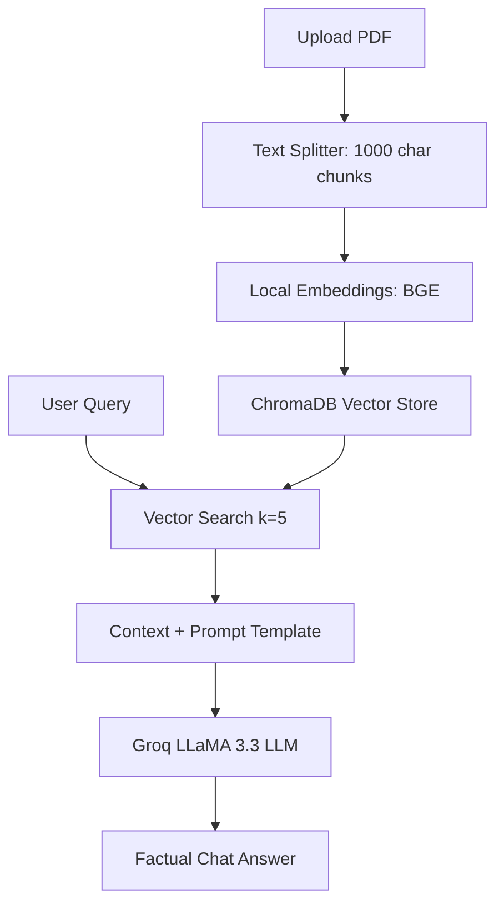

# 🧠 Modular RAG PDF Chatbot with FastAPI, ChromaDB & Streamlit
This project is a modular **Retrieval-Augmented Generation (RAG)** application that allows users to upload PDF documents and chat with an AI assistant that answers queries based on the document content. 
It features a microservice architecture with a decoupled **FastAPI backend** and **Streamlit frontend**, using a local **ChromaDB** as the vector store, local **Hugging Face Embeddings** (`BAAI/bge-small-en-v1.5`), and **Groq's LLaMA 3.3 model** (`llama-3.3-70b-versatile`) as the LLM. 
This local-first vector architecture means that **only a single `GROQ_API_KEY` is required** to run the entire application.
---
## 📂 Project Structure
```
Document-Chat-Bot/
├── .devcontainer/  # VS Code Dev Container environment configuration
├── client/         # Streamlit Frontend
│   ├── components/
│   │   ├── chatUI.py
│   │   ├── history_download.py
│   │   └── upload.py
│   ├── utils/
│   │   └── api.py
│   ├── app.py
│   └── config.py
├── server/         # FastAPI Backend
│   ├── chroma_store/    # Created automatically: stores local vector database
│   ├── modules/
│   │   ├── load_vectorstore.py
│   │   ├── llm.py
│   │   ├── pdf_handlers.py
│   │   └── query_handlers.py
│   ├── uploaded_pdfs/   # Created automatically: temporary PDF upload folder
│   ├── logger.py
│   └── main.py
└── README.md
```
---
## ✨ Features
- 📄 **Upload & Parse PDFs**: Upload multiple PDF documents dynamically from the Streamlit sidebar.
- 🧠 **Local Embeddings**: Generates highly accurate document embeddings locally using `BAAI/bge-small-en-v1.5` via `langchain-huggingface`. No paid external embedding API required!
- 💂️ **Local Vectorstore**: Uses **ChromaDB** on the backend disk to persist and query text chunks.
- 💬 **High-speed Chat**: Queries the documents using the state-of-the-art **LLaMA 3.3 model** via Groq's high-speed API.
- 🌍 **Microservice Architecture**: Decoupled FastAPI server and Streamlit frontend client communicating over REST endpoints.
- 💾 **Chat History Download**: Export your conversation logs directly from the UI.
---
## 🎓 How RAG Works
Retrieval-Augmented Generation (RAG) enhances LLMs by injecting external knowledge. Instead of relying solely on pre-trained data, the model retrieves relevant information from a vector database (like ChromaDB) and uses it to generate accurate, context-aware responses.

---
## 🐳 Quick Start: Docker Dev Container (Recommended)
If you use **VS Code** or **GitHub Codespaces** and have **Docker** installed, you can launch the entire project with one click:
1. Open this folder in VS Code.
2. When prompted, click **"Reopen in Container"** (or open the Command Palette `F1` and choose `Dev Containers: Reopen in Container`).
3. VS Code will build the environment, install python libraries, and automatically launch the Streamlit frontend.
---
## 🚀 Getting Started Locally
### 1. Clone the Repository
```bash
git clone https://github.com/snsupratim/RagBot-2.0.git
cd RagBot-2.0
```
### 2. Setup the Backend (FastAPI)
```bash
cd server
python -m venv venv
source venv/bin/activate  # Windows: venv\Scripts\activate
pip install -r requirements.txt
# Create your environment configuration file (.env)
echo 'GROQ_API_KEY="your_actual_groq_api_key_here"' > .env
# Run the FastAPI server
uvicorn main:app --reload
```
The backend server runs locally on `http://127.0.0.1:8000`.
### 3. Setup the Frontend (Streamlit)
```bash
cd ../client
python -m venv myenv       # Optional: create a separate client environment
source myenv/bin/activate  # Windows: myenv\Scripts\activate
pip install -r requirements.txt
# Run the Streamlit application
streamlit run app.py
```
The client app opens in your browser at `http://localhost:8501`.
---
## 🌐 API Endpoints (FastAPI)
- `POST /upload_pdfs/` — Receives list of PDFs, chunks, embeds, and saves to ChromaDB.
- `POST /ask/` — Takes a text query, retrieves matching chunks, and generates a factual response.
- `GET /test` — Health check endpoint.
